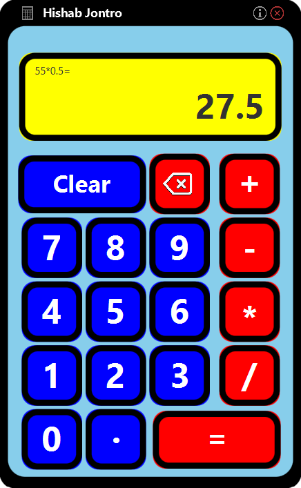

# Hishab Jontro
This is a simple calculator application created using _**JavaFX**_ and **_SceneBuilder_** for my learning purposes.
The calculator can perform basic arithmetic operations such as addition, subtraction, multiplication, and division.

## Features
- **Basic arithmetic operations**: Addition, Subtraction, Multiplication, and Division
- **User-friendly** interface built with JavaFX and SceneBuilder

## How to Run
- Download the JAR file from the [Releases](https://github.com/almahfuz777/Hishab-Jontro/releases/) section.
- Open a terminal or command prompt and run the application using 
  ``` java -jar Hishab-Jontro.jar ```
- Ensure you have Java installed on your machine. You can download the latest version of Java from here.
- If you encounter any issues running the application, ensure that your Java environment is set up correctly.

## Contributing
If you would like to contribute to this project or report any bugs, feel free to 
- submit a pull request or 
- open an issue on the repository.

To clone the repository on your local machine,
```
git clone https://github.com/almahfuz777/Hishab-Jontro.git 
```

## Notes
- The application is built and tested using `JavaFX SDK 21.0.1` and `Zulu JDK 21.0.1`.
- While one can directly download the JAR file for running the application, cloning the Git repository is recommended for those interested in exploring or contributing to the source code

The project was created as a part of my personal learning journey in Java. The code is not optimized for large or complex calculations. Despite some minor bugs, the program is a functional tool for basic mathematical calculations.


